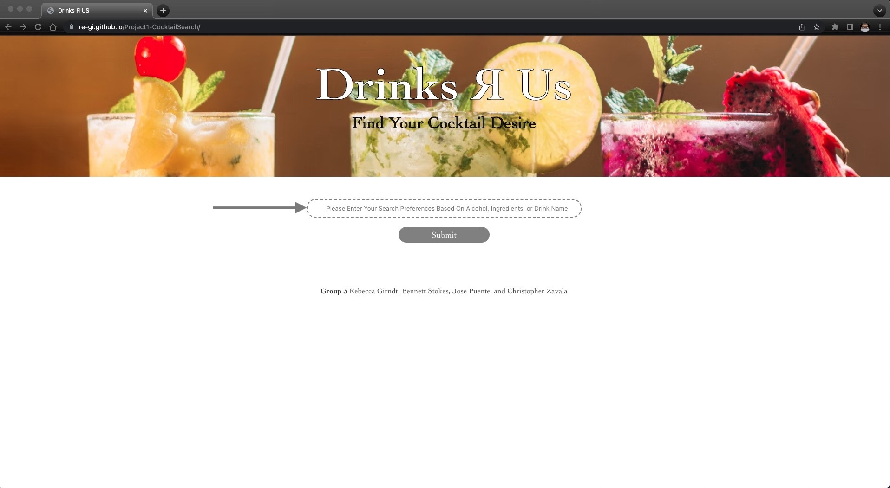
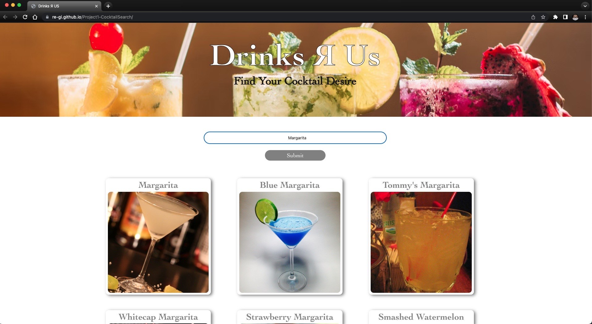
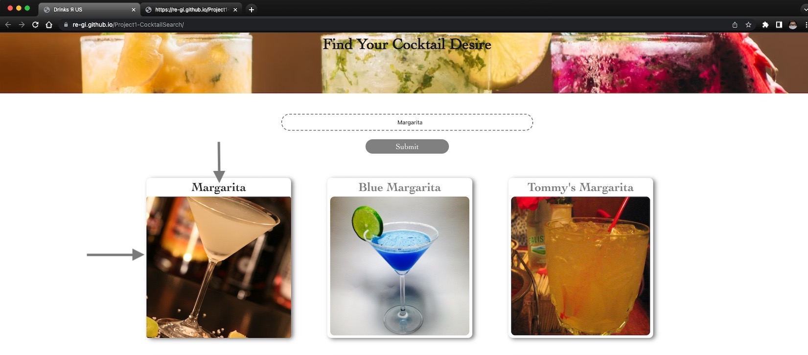
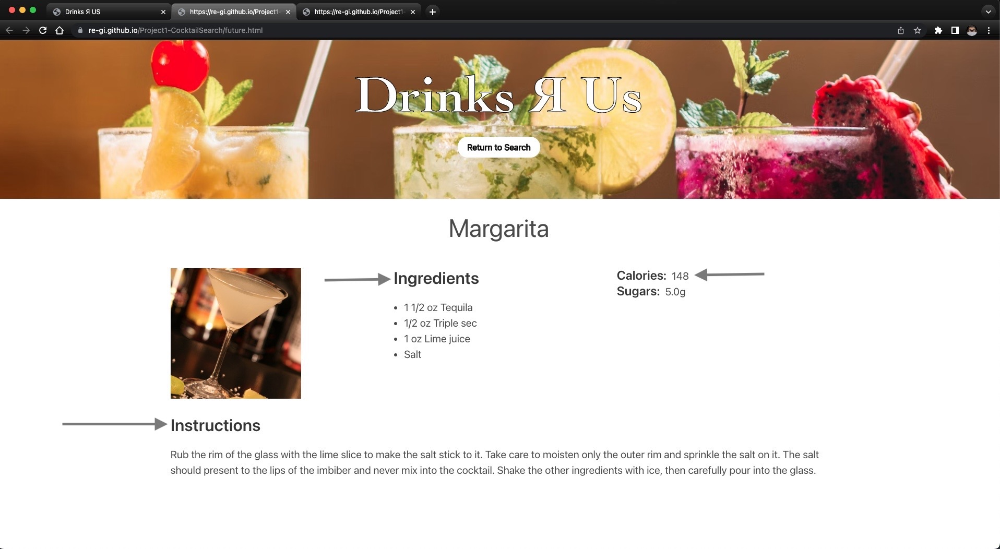
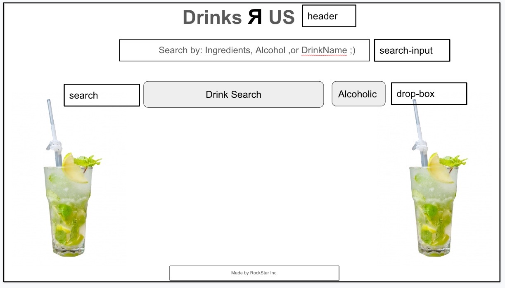
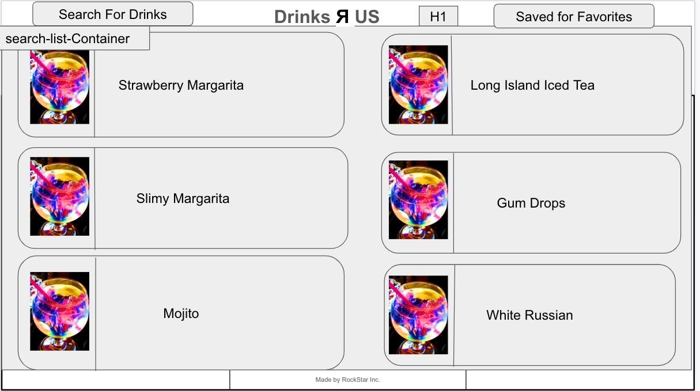
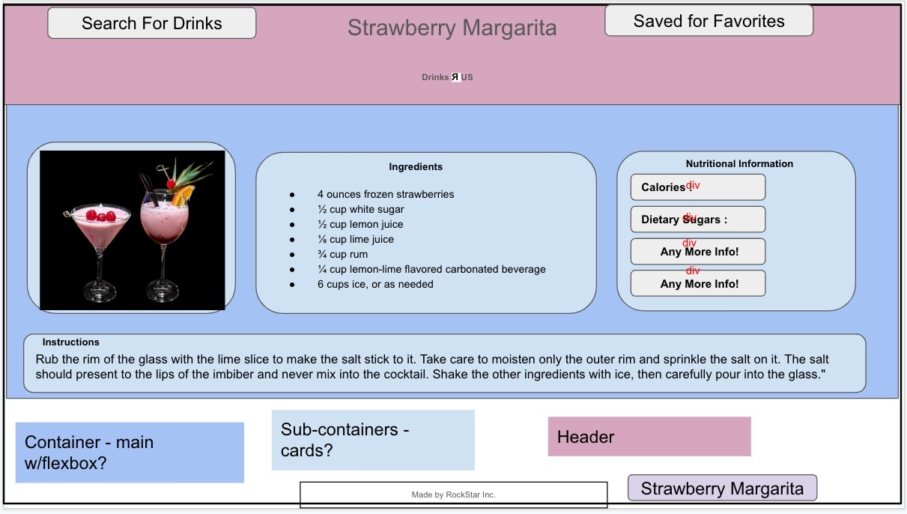

# Drinks Я Us

<a href="https://re-gi.github.io/Project1-CocktailSearch/">Drinks Я Us</a>\
Version 1.0 \
Deployment Date: January 18, 2023  \
Contributors: Rebecca Girndt, Bennett Stokes, Jose Puente, and Christopher Zavala

# Purpose

Drinks Я US is an application that is designed to find your Cocktail by: Alcohol, Ingredients, or Cocktail Name. Designed for people on the move looking for a quick way to access information on how to make their favorite cocktail. We have also provided nutritional facts about the cocktail of their choice. We have provided a search based on what ingredients you might have at your consumption, making your decision of cocktail choice much easier. 

# Getting Started

\
In order to use our application all you need is the browser of your choice and a thirst for your cocktail appetite.

<a href="https://re-gi.github.io/Project1-CocktailSearch/">Drinks Я Us</a>

# Instructions

\
Go to the Website

\
Click on this site and start your experience: 
<a href="https://re-gi.github.io/Project1-CocktailSearch/">Drinks Я Us</a>

\
The following window will appear.

\

\
What you need to do next:

1) Use the Search Box located in the middle of the site and enter your search preference by Alcohol, Ingredients, or Drink Name.

\

2) Click the 'Submit' button - This displays your search criteria in the middle of the site, For our example we have selected a "Margarita".

3) You will then see the search engine provide you with a list of choices based on your search criteria and today's search is a "Type of Margarita".

\

\
When you hover over the cocktail card you would like to select, you are invited to click on the image and see the information provided next. Today we are in the mood for just a plain "Margarita".  

\

\
When you have "Clicked" on the your choice. You will be brought to the main information page. Here you will be shown what "Ingredients" you would need to make the cocktail. The "Instructions" to make the cocktail for yourself and your guests. And some nutritional facts like: "Calories" and "Sugars" to help make a well informative selection for your cocktail of choice. 

\

# Built Using

Bulma:  <https://bulma.io/> \
Microsoft Visual Studio: <https://code.visualstudio.com/> \
GitHub: <https://github.com/>

# Original Contributors
 \
Rebecca Girndt: <https://github.com/Re-Gi> \
Bennett Stokes: <https://github.com/Bennettstokes> \
Jose Puente: <https://github.com/Bevin24> \
Christopher Zavala: <https://github.com/ChrisZavala> 

# Original Idea

\
The idea originally began with Bennett Stokes. He was interested in creating an NBA player statistically experience, however due to time and ambition of the project we decided as a group to transition to a Cocktail Drink Search. This corresponded well with a project that required a CSS framework, being interactive, using at least two API calls, use of client-side storage to store persistent data, integration, and a polished UI. We were able as a team to overcome certain challenges and be very agile in our decision making process. We had fun and created an enjoyable user experience for the application. 

# Project Design

# IceBox

\
There are several ideas pending for possible future development.

1) A location finder for nearby Bars, Restaurants, Grocery Stores to find your Cocktail or Alcohol ASAP.
2) Adding a 'Notes' feature to the "Cocktails Details Page".
3) Allowing for a "Saved Favorites" to create a list for the user. 

# Ideas for Improvement:

\
Have additional ideas for improving this site? Please first discuss the change you wish to make via email with the owners of this repository. Email addresses can be found on the contributor's gitHub pages (links above).

# Credits:
- Hero photo by Kobby Mendez on unsplash
- YouTube Javascript Provider Steve Griffith: <a href="https://www.youtube.com/watch?v=HTA7pEDGZEU&t=335s">Combining Fetch and the Promise Method</a>

